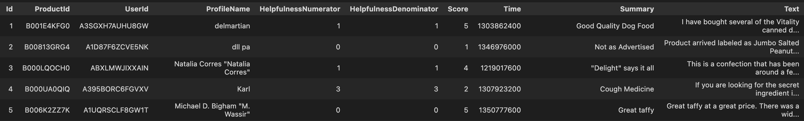

# Food Review API

This repository contains the definition and deployment for the Food Review Service API, a Python FastAPI microservice intended to provide information about the product reviews compressed in this [dataset](#dataset).

* [Dataset](#dataset)
* [Setup](#setup)
   - [Devcontainer](#devcontainer)
   - [Running locally](#running-locally)
   - [How to debug the API](#how-to-debug-the-api)
* [Development](#development)
   - [Code style and linting](#code-style-and-linting)
   - [Testing](#testing)

## Dataset

The [Amazon Fine Good Reviews](https://www.kaggle.com/datasets/snap/amazon-fine-food-reviews) dataset consists of reviews of fine foods from amazon. Reviews include product and user information, ratings, and a plain text review. It also includes reviews from all other Amazon categories. The dataset has been reduced to make the repository lighter.



If the reader is interested to know how the dataset has been reduced, he/she can consult the following [notebook](./notebooks/process_reviews.ipynb).

## Setup

This project requires the following packages to be available:

* [vscode](https://code.visualstudio.com/) to code inside the container with dev containers.
* Docker and Docker Compose, recommended through [Rancher Desktop](https://rancherdesktop.io/).

### Devcontainer

Dev containers are isolated, lightweight environments that allow developers to work inside a containerized version of a build environment. Basically, dev containers give you a pre-configured development environment right inside your editor or IDE.

Clone the respositoy, go to the project folder and open vscode.

```sh
git clone git@github.com:cespeleta/food-review-api.git
cd food-review-api
code .
```

Open the respository in a docker container by clicking on the on the green button in the lower left corner and select *Reaopen in Container*.

### Running locally

The Food Review API can be executed by running the Makefile recipe:

```sh
make run.app
```

This command will start up the FastAPI application and will expose the [Food Review API](http://localhost:8008/docs).

For more information about the endpoints go to the [API documentation](./food_review_api/api/README.md).

### How to debug the API

During application development it is common to test code, use breakpoints and analyze it. To do this, uncomment lines 31-35 of the [main](./food_review_api/api/main.py) file and run the file in debug mode.

## Development

This project uses a flat layout structure, with the main service code under the [food_review_api](./food_review_api/) directory with each subdirectory implemented as a Python package with the following structure:

* **api** package contains the service's FastAPI app implementation, with code to build the FastAPI app as well as defining the API endpoint routes. In addition, it also contains API request/response data transer object schemas.
* **core** package contains common core functionality of the service, such as the definition of the main `Configuration` class and subclasses (e.g. `LogginConfig`). This package can be extended to include metrics instrumentation functions and database session creation functions.
* **products** package contains the definition of functions to interact with the dataset of product reviews, with the implementation of a ProductRepository class to hold loaded product data.
* **utils** package contains utillity functions, e.g. to set up logging configuration.
* **main.py** module contains the main `food_review_api` module entrypoint function as well as the declaration of the main FastAPI application object to serve the API.

### Code style and linting

This project uses [Ruff](https://docs.astral.sh/ruff/) as a linter and formatter. Rules and configurations are set in the [pyproject.toml](./pyproject.toml) file under the `tool.ruff` sections. One can run the linter checks and fixes with this respective Makefile recipes:

```sh
make lint.check
make lint.fix
```

Additionally, pre-commit hooks for running common format checks
(e.g. trailing whitespaces, end-of-file empty lines, etc) and Ruff lint/formatting are also included to ensure unified styling and linting of the code.
One can run pre-commit hooks by executing:

```sh
# For files with changes
pre-commit run
# For all files
pre-commit run --all
```

### Testing

The repository uses [Pytest](https://docs.pytest.org/en/stable/) for the test suite implementation and execution, with tests defined in the [tests](./tests/) directory mimicking the `food_review_api` project structure.

It is encouraged to define [test fixtures](https://docs.pytest.org/en/6.2.x/fixture.html) in `conftest.py` modules inside different test subfolders to provide common fixtures for the underlying tests.

One can run the test suite with the Makefile recipe:

```sh
make test
```
