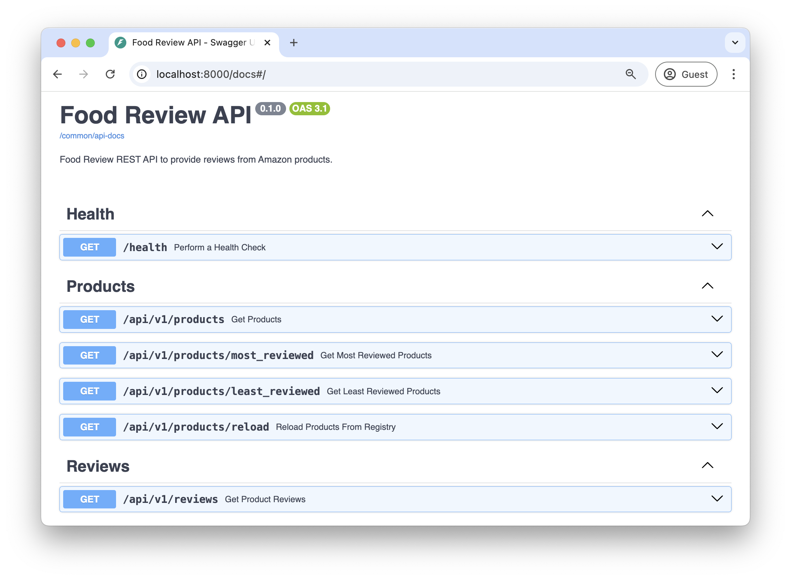
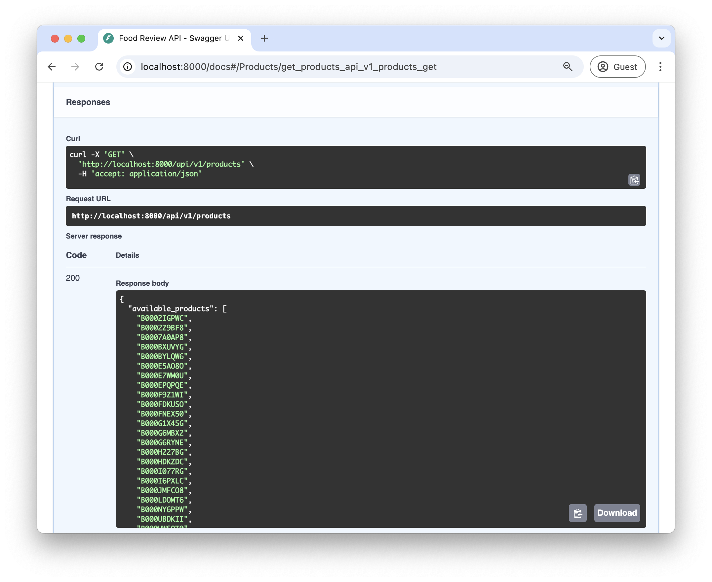
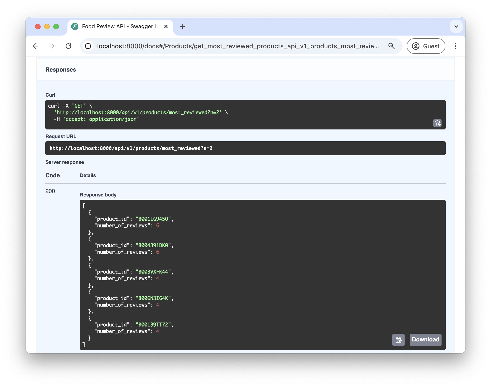
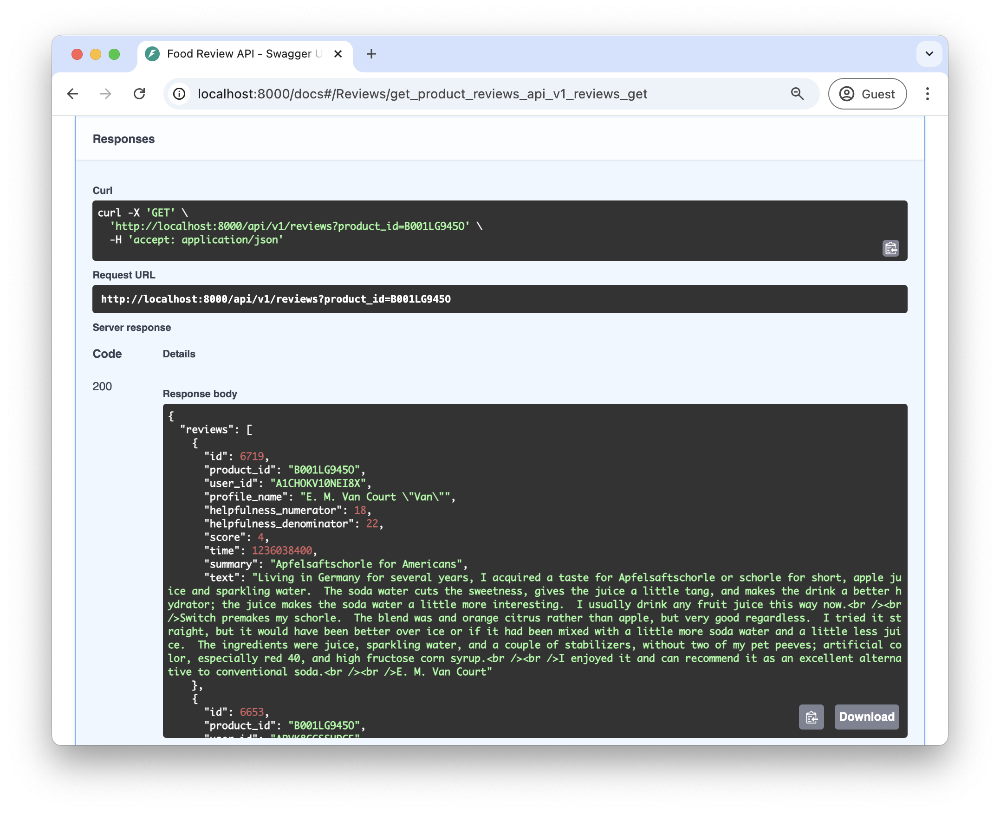

# Food Review Endoints

The Food Review API contains the following endpoints


### Health
This endpoint is primarily used to ensure the API is up and running.

### Products
This endpoint returns a list of all products that are currently loaded in the service.


### most_reviewed 

This endpoint returns the top `n` products with the most reviews.



Similarly, the `least_reviewed` endpoint returns the top `n` products with the leasat reviews.

### Reload

This endpoint triggers a background task to reload the products databae without shutting down the app.

This endpoint can be tested by changing the file used by the app:

1. Execute the app: `make run.app`
2. With the app running, open the [application-local.yaml](../../application-local.yaml)
3. Change the database filename to `data/reviews_2.csv`. It should look like this:

    ```yaml
    database:
        filename: data/reviews_2.csv
    ```

4. Trigger the reload endpoint and the dataset of products will be updated.

### Reviews

This endpoint returns the reviews for a product identifier.


